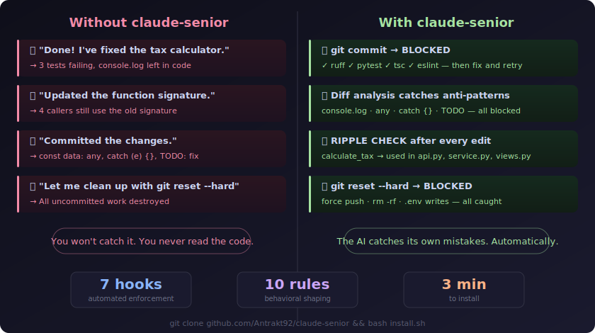

# claude-senior

A hardening framework for [Claude Code](https://docs.anthropic.com/en/docs/claude-code) that turns it from a confident junior into an autonomous senior developer.

**The problem:** Claude Code says "done" without running tests. Commits `: any` types and `console.log`. Changes a function and leaves 4 callers broken. Runs `git push --force` and destroys remote history. You won't catch any of this — because you never read the code.

**The solution:** 7 shell hooks that automatically block bad commits, catch destructive commands, and warn about forgotten callers. 10 behavioral rules in CLAUDE.md that shape how the AI thinks — before it makes mistakes, not after. A memory system that makes it learn from corrections across sessions.

Three layers working together:

- **Behavioral rules** (CLAUDE.md) — "re-read the file before editing", "search ALL callers before changing a function", "stop and rethink after 3 failed attempts"
- **Automated enforcement** (hooks) — every commit must pass linters, tests, and diff analysis. No bypass. Destructive commands blocked before execution
- **Persistent learning** (memory) — AI logs mistakes and applies corrections in future sessions

Not a plugin. Not a skill. Plugins add new tools. **claude-senior** makes the AI better at using the tools it already has.

<p align="center">
  <a href="assets/hero.svg">
    
  </a>
</p>

## Quick start

```bash
git clone https://github.com/Antrakt92/claude-senior.git
cd claude-senior
bash install.sh
```

That's it. Next time Claude Code runs, it's a senior dev. Works on Windows (Git Bash), macOS, and Linux.

## What it blocks

Every `git commit` is intercepted and checked. Both phases must pass — no marker bypass, no skip.

**Phase 1 — Linters & tests** (auto-detected per stack):

`ruff check` + `pytest` for Python. `tsc --noEmit` + `eslint` for TypeScript. `go vet` + `go test` for Go. `cargo check` + `cargo test` for Rust.

**Phase 2 — Diff analysis** (greps staged diff for AI anti-patterns):

| Pattern | Action |
|---------|--------|
| `console.log` in staged code | **Blocked.** Use `console.warn` or `console.error`. |
| `: any`, `<any>`, `as any` | **Blocked.** Use a proper type. |
| `catch (e) {}`, bare `except:` | **Blocked.** Add error handling. |
| `TODO`, `FIXME`, `HACK` | **Blocked.** Finish it or don't commit. |
| 500+ lines added | **Blocked.** Split into smaller commits. |
| Model changed, no migration | **Blocked.** Create the migration. |

**Safety net** (destructive commands blocked before execution):

| Command | Action |
|---------|--------|
| `git push --force` | **Blocked.** Use `--force-with-lease`. |
| `git reset --hard` | **Blocked.** Stash first. |
| `rm -rf src/` | **Blocked.** Build artifacts like `node_modules/` are whitelisted. |
| `echo SECRET > .env` | **Blocked.** Secrets stay out of AI reach. |

**Ripple effect warning** (after every file edit):

When you edit a file, the hook greps the codebase for every function/class/constant defined in that file and warns if they're used elsewhere. Non-blocking — it's a reminder to check callers.

## Why this exists

Claude Code is a strong junior developer. These are the failure modes that keep it there — and what claude-senior does about each one:

| AI failure mode | What goes wrong | How claude-senior fixes it |
|----------------|-----------------|---------------------------|
| **Ripple effect** (#1) | Changes function signature, leaves callers broken | `ripple-check.sh` warns about all usages after every edit |
| **Stale mental model** (#2) | Edits file from memory, not from disk | CLAUDE.md Read-Before-Edit Rule: must re-read within 3 tool calls |
| **False confidence** | "Fixed!" — tests are broken | `pre-commit-review.sh` runs full test suite, blocks on failure |
| **Lazy types** | `any` everywhere, empty `catch {}` | Phase 2 diff analysis catches these in staged code |
| **Debug artifacts** | `console.log`, `TODO` left in commits | Phase 2 blocks until removed |
| **Destructive commands** | `git push --force`, `rm -rf` | `block-dangerous-git.sh` intercepts before execution |
| **Loop-and-tweak** | Retries same failing approach 5 times | CLAUDE.md 3-Strike Rule: stop, re-read, try opposite approach |

## Architecture

```
~/.claude/                              GLOBAL — all projects
├── CLAUDE.md                           10 behavioral rules
├── settings.json                       permissions + hook registration
└── hooks/
    ├── block-dangerous-git.sh          blocks destructive git/rm/env commands
    ├── block-protected-files.sh        blocks .env and lockfile edits
    ├── pre-commit-review.sh            quality gate: linters + tests + diff analysis
    ├── auto-lint-python.sh             ruff autofix after every edit
    ├── auto-lint-typescript.sh         eslint autofix after every edit
    └── ripple-check.sh                 warns when edited code is used elsewhere

project/.claude/                        PROJECT — per-repo overrides
├── settings.json                       project-specific hooks
└── hooks/
    └── pre-commit-review.sh            project-specific checks (e.g. console.log)
```

Global hooks fire in every project. Project hooks override globals with double-fire prevention.

## How it works

### Pre-commit quality gate

Every `git commit` triggers a two-phase check:

**Phase 1 — Linters & tests** (auto-detected per stack):
- Python: `ruff check` + `pytest`
- TypeScript: `tsc --noEmit` + `eslint`
- Go: `go vet` + `go test`
- Rust: `cargo check` + `cargo test`

**Phase 2 — Diff analysis** (greps staged diff for anti-patterns):
- `: any`, `<any>`, `as any` in TypeScript
- `catch (e) {}`, bare `except:` — empty error handling
- `TODO`, `FIXME`, `HACK`, `XXX` — unfinished work
- `console.log` — debug code (only `console.warn`/`error` allowed)
- 500+ added lines — commit too large
- Model changes without migration

Both phases block with no bypass. Fix the code, retry.

### Safety net

`block-dangerous-git.sh` intercepts destructive commands before execution:

```
git push --force       →  BLOCKED (use --force-with-lease)
git reset --hard       →  BLOCKED (stash first)
git checkout .         →  BLOCKED (stash first)
rm -rf src/            →  BLOCKED (rm -rf node_modules/ is whitelisted)
echo SECRET > .env     →  BLOCKED (edit .env manually)
```

Per-operation bypass via marker file (single-use, 5-minute expiry) when user explicitly approves.

### Ripple effect protection

After every file edit, `ripple-check.sh` greps the codebase for definitions you just changed and warns:

```
RIPPLE CHECK: definitions in tax_calculator.py are also used in:
  calculate_total_tax → src/service.py:42 src/api.py:18
  TaxCalculator → src/views.py:7
Did you update all callers?
```

Non-blocking (exit 0) — it's a reminder, not a gate.

### Auto-formatting

After every `Edit`/`Write`:
- Python files → `ruff check --fix` + `ruff format`
- TypeScript files → `eslint --fix`

If the formatter changes the file, the AI is forced to re-read it before the next edit. This prevents the #2 failure mode (editing from stale memory).

## CLAUDE.md Rules

10 sections of behavioral rules:

| Rule | What it prevents |
|------|-----------------|
| **Ripple Effect Rule** | "Search ALL usages before changing any function" — prevents broken callers |
| **Read-Before-Edit Rule** | "Re-read file if not read in last 3 tool calls" — prevents stale edits |
| **3-Strike Rule** | "Stop and rethink after 3 failed attempts" — prevents loop-and-tweak |
| **Test Failure Recovery** | "Read error → read test → read source → then fix" — prevents guessing |
| **Change Size Rule** | "5+ files → write a plan first" — prevents lost overview |
| **Uncertainty Disclosure** | "If unsure, say so explicitly" — prevents false confidence |
| **Verification Rule** | "Never say 'done' without fresh test evidence" — prevents shipping broken code |

Plus: autonomy guidelines, code style for AI readability, security rules, self-improvement protocol.

## Adding project-specific hooks

Global hooks work automatically. For project-specific checks, copy a template:

```bash
# TypeScript project
cp -r projects/timesheet/.claude your-project/

# Python project
cp -r projects/clipboard-history/.claude your-project/

# Full stack (Python + TypeScript)
cp -r projects/investments-calculator/.claude your-project/
```

Then adapt `pre-commit-review.sh` to your stack.

## Test suite

```bash
# Global hooks
bash ~/.claude/hooks/test-hooks.sh

# Project hooks (from project root)
bash .claude/hooks/test-hooks.sh
```

## Known limitations

- **String-based analysis** — can't inspect `bash script.sh` contents or variable expansion
- **No AST parsing** — ripple check uses regex, may miss complex patterns
- **Per-line CSS check** — `linear-gradient(#fff, var(--x))` skipped because line contains `var(--`

All documented in hook source as `KNOWN LIMITATION` tags.

## Contributing

Found a bypass? Open an issue with the exact command, which hook should catch it, and why the regex misses it.
