# claude-code-config

A configuration system that turns Claude Code from a capable assistant into an autonomous AI developer. Behavioral rules, automated enforcement, and persistent learning — three layers that compound to give you an estimated 40-60% boost in speed, quality, and reliability over vanilla Claude Code.

<p align="center">
  <a href="assets/demo.svg">
    
  </a>
  <br>
  <em>Click to see animated demo (3 scenes)</em>
</p>

## What it gives you

| Capability | How it works |
|------------|-------------|
| **Full autonomy** | AI makes all technical decisions, tests, debugs, commits — you direct, it executes |
| **Quality gate** | Every commit must pass ruff + pytest + tsc + eslint before it lands (no bypass) |
| **Auto-formatting** | ruff/eslint auto-fix after every file edit, AI re-reads automatically |
| **Ripple effect protection** | Hook warns when edited definitions are used elsewhere — AI's #1 failure mode |
| **Safety net** | Force push, `reset --hard`, `rm -rf`, `.env` writes — blocked before execution |
| **AI-specific coding rules** | Covers 12 known failure modes of AI-generated code (see below) |
| **Persistent memory** | AI logs mistakes and learns from them across sessions |

## AI failure modes this system addresses

Vanilla Claude Code is a strong junior developer. These are the failure modes that keep it there:

| When | Failure mode | What goes wrong |
|------|-------------|-----------------|
| Writing | **Code duplication** | Creates new helper instead of finding the existing one |
| Writing | **Hardcoded values** | `0.33` in 5 places — updates one, forgets four |
| Writing | **Missing types** | `def process(data, config)` — future AI passes wrong types |
| Writing | **Implicit state** | Depends on global variable AI won't see when reading just that function |
| Writing | **Happy-path only** | No null/empty/zero/boundary guards — no reviewer will catch it |
| Changing | **Ripple effect (#1)** | Changes function signature, leaves 4 callers broken |
| Changing | **Stale mental model (#2)** | Edits file from memory instead of re-reading — introduces conflicts |
| Changing | **Stale comments** | Changes logic but not the comment above it — next AI "fixes" working code |
| Verifying | **False confidence** | Says "fixed" without running tests — "should work" = hasn't verified |
| Verifying | **Partial test runs** | Runs only the "related" test, misses breakage in 3 other files |
| Debugging | **Loop-and-tweak** | Retries same failing approach with small variations instead of rethinking |

The CLAUDE.md rules address all of these. The hooks enforce the critical ones automatically.

## Architecture

```
~/.claude/                              GLOBAL — all projects
├── CLAUDE.md                           10 behavioral rules
├── settings.json                       permissions + hook registration
└── hooks/
    ├── block-dangerous-git.sh          PreToolUse:Bash — blocks destructive commands
    ├── block-protected-files.sh        PreToolUse:Edit|Write — blocks .env/lockfiles
    ├── pre-commit-review.sh            PreToolUse:Bash — quality gate on commit
    ├── auto-lint-python.sh             PostToolUse:Edit|Write — ruff autofix
    ├── auto-lint-typescript.sh         PostToolUse:Edit|Write — eslint autofix
    └── ripple-check.sh                 PostToolUse:Edit|Write — caller usage warnings

project/.claude/                        PROJECT — per-repo additions
├── settings.json                       project-specific hook registration
├── hooks/
│   └── check-css-variables.sh          PostToolUse:Edit|Write (example)
└── agents/
    ├── code-reviewer.md                quality review on staged changes
    ├── security-reviewer.md            security audit (OWASP, injection, auth)
    └── ripple-checker.md               deep caller analysis agent
```

Both global and project hooks fire on every tool call. **Never register the same hook in both** — it will run twice.

## Hooks

### What each hook does

| Hook | Trigger | Behavior |
|------|---------|----------|
| `block-dangerous-git.sh` | PreToolUse:Bash | **Blocks:** `git push --force`, `reset --hard`, `clean -f`, `checkout .`, `restore .`, `branch -D`, `stash drop/clear`, `rm -rf`, `alembic downgrade`, `.env` writes |
| `block-protected-files.sh` | PreToolUse:Edit\|Write | **Blocks:** direct edits to `.env*` (not `.env.example`) and lock files |
| `pre-commit-review.sh` | PreToolUse:Bash | **Phase 1:** runs linter/type-checker/tests — blocks until code passes. **Phase 2:** review checklist — blocks until AI confirms via marker file |
| `auto-lint-python.sh` | PostToolUse:Edit\|Write | Runs `ruff check --fix` + `ruff format`, forces AI to re-read on change |
| `auto-lint-typescript.sh` | PostToolUse:Edit\|Write | Runs `eslint --fix`, forces AI to re-read on change |
| `ripple-check.sh` | PostToolUse:Edit\|Write | Greps codebase for definitions in edited file, warns about callers (non-blocking) |
| `check-css-variables.sh` | PostToolUse:Edit\|Write | Warns on hard-coded hex/px/transition values in CSS (project-level) |

### How hooks communicate with AI

Claude Code hooks use `exit 2` + `stderr` to send messages to the AI (`exit 0` + `stdout` is silently discarded).

**Marker file pattern** for "block then allow":
```
Hook blocks (exit 2) → AI reads stderr → AI does the work →
AI runs: touch /tmp/claude-marker-HASH → retries → Hook sees marker → exit 0
```
Markers are per-operation and expire after 5 minutes.

## CLAUDE.md Rules

10 sections covering autonomous AI behavior:

| # | Section | Purpose |
|---|---------|---------|
| 1 | **Autonomy** | AI makes all technical decisions without asking for confirmation |
| 2 | **Judgment Over Execution** | Read callers before changing code, look up APIs when unsure |
| 3 | **Ripple Effect Rule** | Search ALL usages before changing any function/type/constant |
| 4 | **Verification & Resilience** | Never say "done" without fresh test evidence; 3-strike rule |
| 5 | **Scope & Simplicity** | Follow existing patterns, use existing utilities, don't over-engineer |
| 6 | **Writing Code for AI** | Types as documentation, named constants, WHY/WARNING/SYNC comments |
| 7 | **Security** | CSV injection prevention, beyond Claude Code defaults |
| 8 | **Self-Improvement** | Save corrections to memory, maintain improvement log |
| 9 | **Global Hooks** | Documents hook architecture and config repo symlink setup |
| 10 | **End-of-Session** | Check for uncommitted changes, save handoff notes |

## Memory System

AI maintains a file-based memory (`~/.claude/projects/<project>/memory/`) with an index (`MEMORY.md`) loaded every conversation. Memory files use frontmatter with `name`, `description`, and `type` fields. The AI decides which files to open based on the index — keeping token usage low while preserving cross-session learning.

Types: `user` (who you are), `feedback` (corrections), `project` (ongoing work context), `reference` (external system pointers).

## Installation

### New machine setup

```bash
git clone https://github.com/Antrakt92/claude-code-config.git
cd claude-code-config
bash install.sh
```

The install script creates **symlinks** from `~/.claude/` to `global/` — edits auto-sync to the repo. Backs up existing files first. Requires Developer Mode on Windows.

### Adding project-specific hooks

Global hooks work automatically after install. For project-specific hooks, copy from `projects/` templates:

```bash
# TypeScript project
cp -r projects/timesheet/.claude your-project/

# Python project
cp -r projects/clipboard-history/.claude your-project/

# Full stack (Python + TypeScript)
cp -r projects/investments-calculator/.claude your-project/
```

Then adapt `pre-commit-review.sh` commands to match your stack.

## Repo Structure

```
global/              symlinked to ~/.claude/ — active global config
projects/            reference .claude/ configs for 3 project types
memory/              backup of per-project AI memory files
install.sh           symlink setup script
AUDIT.md             audit prompt for systematic hook review
```

## Test Suite

106 tests covering all hook logic:
```bash
bash .claude/hooks/test-hooks.sh
```

Covers: command matching, false positive/negative edge cases, JSON escape handling, chained command splitting, CSS pattern detection, marker file lifecycle.

## Known Limitations

- **String-based analysis only** — hooks can't inspect `bash script.sh` contents or `python -c "..."` payloads
- **No variable expansion** — `CMD="git push --force" && $CMD` bypasses checks
- **Split rm flags** — catches `-rf`/`-r` as single cluster, not separate `-f -r`
- **CSS checker is per-line** — `linear-gradient(#fff, var(--x))` skipped because line contains `var(--`
- **Ripple check is regex-based** — no AST parsing, may miss complex patterns or produce false positives

Documented in hook comments as `KNOWN LIMITATION` tags.

## Contributing

Found a bypass? Open an issue with:
1. The exact command that passes when it shouldn't
2. Which hook should catch it
3. Why the current regex misses it
