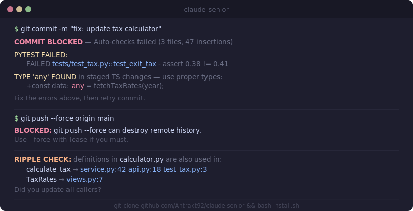

# claude-senior

Hardening framework for [Claude Code](https://docs.anthropic.com/en/docs/claude-code) that turns it from a confident junior into an autonomous senior developer.

**The problem:** Claude Code says "done" without running tests. Commits `: any` types and empty `catch {}`. Changes a function and leaves 4 callers broken. Runs `git push --force` and destroys remote history.

You won't catch any of this — because you never read the code.

**The solution:** 7 shell hooks and 10 behavioral rules that install into `~/.claude/` and work across all your projects. Every commit is quality-gated. Every destructive command is blocked. Every file edit triggers a ripple check.

<p align="center">
  <a href="assets/hero-v4.svg">
    
  </a>
</p>

## Quick start

```bash
git clone https://github.com/Antrakt92/claude-senior.git
cd claude-senior
bash install.sh
```

That's it. Next time Claude Code runs, it's a senior dev. Works on Windows (Git Bash), macOS, and Linux.

## How it works

Three layers working together:

- **Automated enforcement** (hooks) — every commit must pass linters, tests, and diff analysis. Destructive commands blocked before execution.
- **Behavioral rules** (CLAUDE.md) — "re-read the file before editing", "search ALL callers before changing a function", "stop after 3 failed attempts".
- **Persistent learning** (memory) — AI logs mistakes and applies corrections in future sessions.

Not a plugin. Plugins add new tools. **claude-senior** makes the AI better at using the tools it already has.

### Pre-commit quality gate

Every `git commit` triggers a two-phase check. Both phases must pass — no bypass, no skip.

**Phase 1** auto-detects your stack and runs the appropriate tools:
- Python: `ruff check` + `pytest`
- TypeScript: `tsc --noEmit` + `eslint`
- Go: `go vet` + `go test`
- Rust: `cargo check` + `cargo test`

**Phase 2** greps the staged diff for AI anti-patterns:

| Pattern | Why it's blocked |
|---------|-----------------|
| `: any`, `= any`, `Record<string, any>` | AI uses `any` when the correct type is complex. Always wrong in strict TS. |
| `catch (e) {}`, bare `except:` | AI swallows errors silently. Must add `console.warn`/`error` or logging. |
| `TODO`, `FIXME`, `HACK` | AI leaves notes-to-self that never get fixed. Finish it or don't commit. |
| 500+ lines added | Large commits mean AI lost overview. Split into smaller, reviewable pieces. |
| Model changed, no migration | Model changes without migration = broken DB on deploy. |

Project-specific hooks can add more checks: `console.log` detection, new files without tests, CSS variable enforcement.

### Safety net

`block-dangerous-git.sh` intercepts destructive commands before execution:

```
git push --force         →  BLOCKED  (use --force-with-lease)
git reset --hard         →  BLOCKED  (stash first)
git checkout .           →  BLOCKED  (stash first)
rm -rf src/              →  BLOCKED  (node_modules/ is whitelisted)
echo SECRET > .env       →  BLOCKED  (edit .env manually)
alembic downgrade        →  BLOCKED  (verify with user first)
```

Per-operation bypass via marker file (single-use, 5-minute expiry) when user explicitly approves.

### Ripple effect protection

After every file edit, `ripple-check.sh` greps the codebase for definitions you just changed:

```
RIPPLE CHECK: definitions in tax_calculator.py are also used in:
  calculate_total_tax → src/service.py:42 src/api.py:18
  TaxCalculator → src/views.py:7
Did you update all callers?
```

Non-blocking (exit 0) — it's a reminder, not a gate.

### Auto-formatting

After every `Edit`/`Write`:
- Python files → `ruff check --fix` + `ruff format`
- TypeScript files → `eslint --fix`

If the formatter changes the file, the AI is forced to re-read it before the next edit. Prevents the stale-memory failure mode.

## Why this exists

These are the failure modes that keep Claude Code as a junior — and what claude-senior does about each:

| AI failure mode | What goes wrong | How claude-senior fixes it |
|----------------|-----------------|---------------------------|
| **Ripple effect** (#1) | Changes function signature, leaves callers broken | `ripple-check.sh` warns about all usages after every edit |
| **Stale mental model** (#2) | Edits file from memory, not from disk | Read-Before-Edit Rule: must re-read within 3 tool calls |
| **False confidence** | "Fixed!" — tests are broken | `pre-commit-review.sh` runs full test suite, blocks on failure |
| **Lazy types** | `any` everywhere, empty `catch {}` | Phase 2 diff analysis catches these in staged code |
| **Debug artifacts** | `console.log`, `TODO` left in commits | Phase 2 blocks until removed |
| **Destructive commands** | `git push --force`, `rm -rf` | `block-dangerous-git.sh` intercepts before execution |
| **Loop-and-tweak** | Retries same failing approach 5 times | 3-Strike Rule: stop, re-read, try opposite approach |

## Behavioral rules (CLAUDE.md)

10 sections of behavioral rules, applied to every project:

| Rule | What it prevents |
|------|-----------------|
| **Ripple Effect Rule** | "Search ALL usages before changing any function" — prevents broken callers |
| **Read-Before-Edit Rule** | "Re-read file if not read in last 3 tool calls" — prevents stale edits |
| **3-Strike Rule** | "Stop and rethink after 3 failed attempts" — prevents loop-and-tweak |
| **Test Failure Recovery** | "Read error → read test → read source → then fix" — prevents guessing |
| **Change Size Rule** | "5+ files → write a plan first" — prevents lost overview |
| **Uncertainty Disclosure** | "If unsure, say so explicitly" — prevents false confidence |
| **Verification Rule** | "Never say 'done' without fresh test evidence" — prevents shipping broken code |

Plus: autonomy guidelines, code style for AI readability, security rules, self-improvement protocol.

## Architecture

```
~/.claude/                              GLOBAL — all projects
├── CLAUDE.md                           10 behavioral rules
├── settings.json                       permissions + hook registration
└── hooks/
    ├── block-dangerous-git.sh          blocks destructive git/rm/env commands
    ├── block-protected-files.sh        blocks .env and lockfile edits
    ├── pre-commit-review.sh            quality gate: linters + tests + diff analysis
    ├── auto-lint-python.sh             ruff autofix after every edit
    ├── auto-lint-typescript.sh         eslint autofix after every edit
    └── ripple-check.sh                 warns when edited code is used elsewhere

project/.claude/                        PROJECT — per-repo overrides
├── settings.json                       project-specific hook registration
└── hooks/
    └── pre-commit-review.sh            project-specific checks
```

Global hooks fire in every project. Project hooks override globals via double-fire prevention: global hooks detect `project/.claude/hooks/<name>.sh` and skip automatically.

## Project-specific hooks

Global hooks work automatically. For project-specific checks, create `.claude/hooks/pre-commit-review.sh` in your repo.

Examples of project-specific additions:
- **`console.log` detection** — block commits with `console.log` (allow `console.warn`/`error`)
- **New file without test** — block new services/routers without a corresponding test file
- **CSS variable enforcement** — warn when hard-coded hex/px values should use CSS variables

See the [`global/hooks/pre-commit-review.sh`](global/hooks/pre-commit-review.sh) as a starting point. Copy it, remove stacks you don't use, add project-specific Phase 2 checks.

Register project hooks in `.claude/settings.json`:

```json
{
  "hooks": {
    "PreToolUse": [{
      "matcher": "Bash",
      "hooks": [{ "type": "command", "command": "bash .claude/hooks/pre-commit-review.sh" }]
    }]
  }
}
```

## Test suite

Every regex pattern in every hook is covered by automated tests.

```bash
# Global hooks (49 tests)
bash ~/.claude/hooks/test-hooks.sh
```

## Known limitations

- **String-based analysis** — can't inspect `bash script.sh` contents or variable expansion
- **No AST parsing** — ripple check uses regex, may miss complex patterns
- **Single-line matching** — multi-line `catch (e) {\n}` is not caught
- **Per-line CSS check** — `linear-gradient(#fff, var(--x))` skipped because line contains `var(--`

All documented in hook source as `KNOWN LIMITATION` comments.

## Contributing

Found a bypass? Open an issue with the exact command, which hook should catch it, and why the regex misses it.
